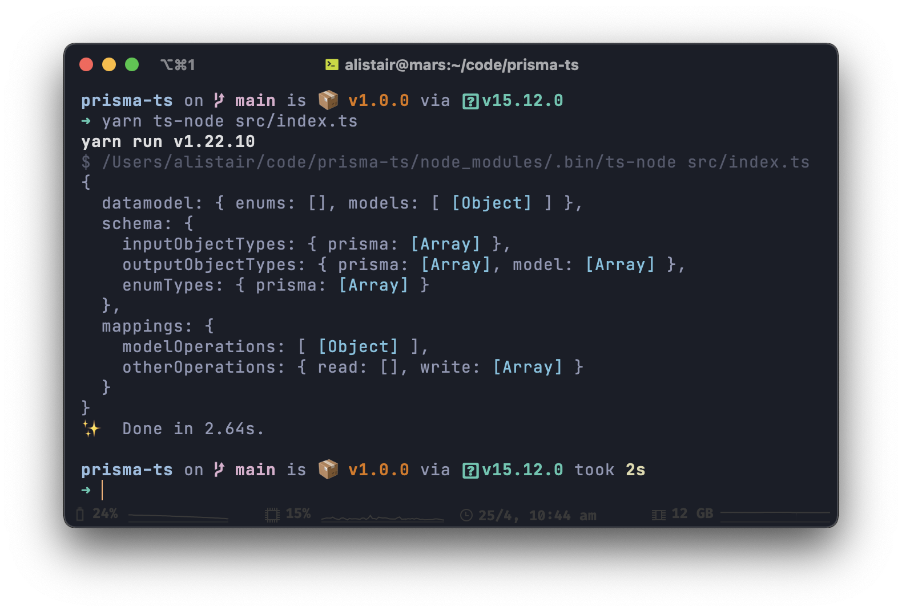

# `trisma`

###### `[t]ypescript p[risma]`

This is an experimental way of creating a Prisma DMMF with TypeScript Decorators.

### What does it look like?

```typescript
@Model()
export class Example {
  @ID()
  @Field()
  @Documentation("This is the ID of the row")
  @Default("uuid()")
  id!: string;

  @Field()
  @Nullable()
  @Array(String)
  names?: string[];

  @Field()
  @Default(0)
  @Unique()
  count!: number;
}
```

### Do it work doe????

Yes, it does generate a valid DMMF... mostly:



### Can I actually use it?

Not yet. I have no idea how to convert a Prisma DMMF into a working Prisma Client (including migrations, studio, etc).

### When will I be able to?

If any of the Prisma team are reading this, plz halp!!!
